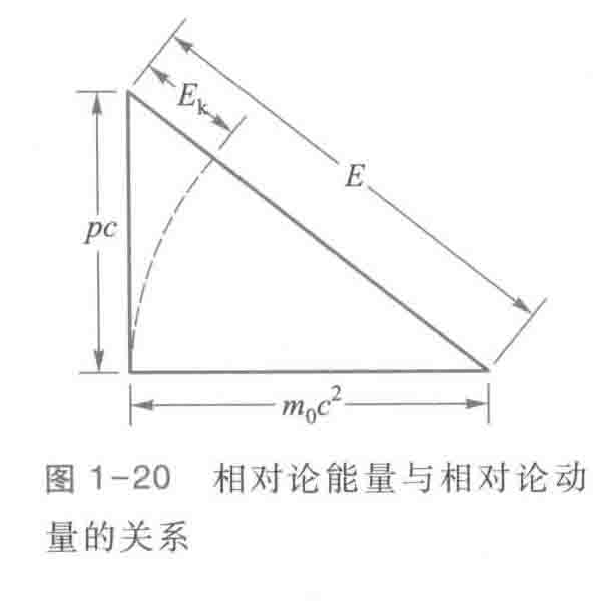

# 相对论力学基础
## 相对论动量和质量
$$m = \gamma m_0 = \frac{m_0}{\sqrt{1 - \frac{v^2}{c^2}}}$$
$$\boldsymbol{p} = \gamma m_0 \boldsymbol{v} = \frac{m_0\boldsymbol{v}}{\sqrt{1 - \frac{v^2}{c^2}}}$$
$$\boldsymbol{F} = \frac{\mathrm{d}\boldsymbol{p}}{\mathrm{d}t} = m \frac{\mathrm{d}\boldsymbol{v}}{\mathrm{d}t} + \frac{\mathrm{d}m}{\mathrm{d}t}\boldsymbol{v} = m\boldsymbol{a} + \frac{\mathrm{d}m}{\mathrm{d}t}\boldsymbol{v}$$

## 质能关系
### 相对论动能
$$\mathrm{d}A = \boldsymbol{F}\cdot\mathrm{d}\boldsymbol{r}$$
求粒子被加速到速度 $v$ 时的动能
$$A = \int_0^v \boldsymbol{F}\cdot\mathrm{d}\boldsymbol{x} = \int_0^v \frac{\mathrm{d}(mv)}{\mathrm{d}t}\mathrm{d}x = \int_0^v v\mathrm{d}(mv)$$
由
$$m^2(c^2 - v^2) = m_0^2c^2$$
得
$$2mc^2\mathrm{d}m - 2mv\mathrm{d}(mv) = 0$$
得
$$c^2\mathrm{d}m = v\mathrm{d}(mv)$$
代入上式得
$$A = \int_0^v v\mathrm{d}(mv) = \int_0^v c^2\mathrm{d}m = c^2(m - m_0)$$
因此可得粒子的动能为
$$E_k = c^2(m - m_0)$$
另外，当 $v \ll c$ 时，利用泰勒展开式可得
$$E_k = m_0c^2\left(\frac{1}{\sqrt{1 - \frac{v^2}{c^2}}} - 1\right) \approx \frac{1}{2}m_0v^2$$

### 相对论能量
在上式中动能被表示为两项的差，其中 $m_0c^2$ 与静止质量有关，称为静止能量，用 $E_0$ 表示， $mc^2$ 与相对论质量有关，称为相对论能量或总能量，用 $E$ 表示，即  
$$E = mc^2$$
这就是爱因斯坦的**质能关系**。

质量和能量是物质相互联系、不可分割的两个基本属性，二者之间可以相互转化，质量可以转化为能量，能量也可以转化为质量。

静止能量是牛顿力学中没有的全新的物理概念，它表明孤立的物体即使静止也具有能量，这种能量包括物体内所有微观粒子的动能和势能等一切形式的能量，是物体内能的总和．

### 相对论能量守恒定律
$$\sum_i E_i = \sum_i m_ic^2 = \text{常量} \Longleftrightarrow \sum_i m_i = \text{常量}$$

能量守恒定律和质量守恒定律是**等价**的，二者被独立发现，在相对论中被统一起来。
但是应该明确，质量守恒指的是**相对论运动质量**的守恒，而不是**静止质量**的守恒。

### 质量亏损
$$E = m_0c^2 + E_k$$
如果在一个封闭系统中发生了一个变化或反应，反应前后粒子的静止质量由 $m_{0_1}$ 变为 $m_{0_2}$，相应的动能由 $E_{k_1}$ 变为 $E_{k_2}$，则有
$$m_{0_1}c^2 + E_{k_1} = m_{0_2}c^2 + E_{k_2}$$
即
$$\Delta m_0c^2 = \Delta E_k$$

## 相对论能量和动量的关系
将 $m = \frac{m_0}{\sqrt{1 - \frac{v^2}{c^2}}}$ 代入 $E = mc^2$ 和 $p = mv$ 可得
$$E^2 = p^2c^2 + m_0^2c^4$$
这就是相对论能量和动量之间的关系式

